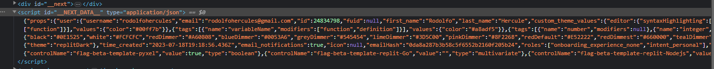
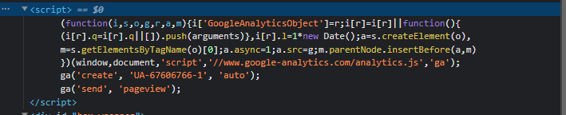

# Trabalho:

- Replit - https://replit.com/learn
- Cooperativafocus - https://cooperativafocus.pt/ 

# Replit:

No script do replit, ele criou um script para identificar meu primeiro nome, meu sobrenome, o número de identificação da minha conta, meu Email, e se estava usando ou não tema no replit. É uma plataforma que conheci a pouco tempo e estou usando bastante. 

# Cooperativa Focus:

Esse código é uma implementação do Google Analytics, uma ferramenta de análise de dados fornecida pelo Google que permite rastrear e analisar o tráfego de um site. Ele é usado para coletar informações sobre como os usuários interagem com um site, como quais páginas eles visitam, quanto tempo passam em cada página e de onde eles vêm.

